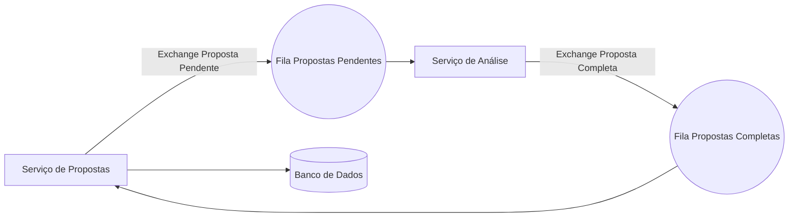

# CreditCheck- Microsserviços com RabbitMQ

Sistema de análise de crédito com arquitetura de microsserviços. A comunicação entre os serviços é feita de forma assíncrona via RabbitMQ, garantindo desacoplamento, resiliência e escalabilidade.  

[](https://skillicons.dev)


## 🔄 Arquitetura do Sistema


## Funcionalidades

- Solicitação de crédito pelo Serviço de Propostas  
- Processamento assíncrono via RabbitMQ  
- Análise automatizada com resultado aprovado/reprovado  
- Armazenamento do histórico das propostas  
- Visualização com justificativa da decisão  

---

## Endpoints

| Método | Endpoint     | Ação                                 |
|--------|--------------|--------------------------------------|
| POST   | `/propostas` | Criar uma nova proposta de crédito   |
| GET    | `/propostas` | Listar todas as propostas cadastradas |

---

## Decisões Arquiteturais

- Microsserviços para praticar escalabilidade e baixo acoplamento  
- RabbitMQ como broker para comunicação assíncrona  
- Docker para orquestração dos ambientes  
- Pattern Strategy aplicado nas regras de score  
- Configuração programática de queues, exchanges e bindings  

---

## Tecnologias Utilizadas

- Java 21  
- Spring Boot (JPA, Web, Security)  
- Spring Cloud Netflix (Config Server, Discovery, Gateway)  
- Spring Cloud OpenFeign  
- RabbitMQ  
- PostgreSQL  
- Docker  

---

## Aprendizados
- Conceitos filas, exchanges, consumers ✔️
- Diferença de monolitico e arquitetura de microsserviços ✔️
- Configuração de resiliência e desacoplamento via mensageria ✔️
- Testes de integração com filas ✔️
- Segurança entre serviços ✔️
- Estratégias de escalabilidade ✔️ 

---

## Execução Local

### Requisitos

<p align="left">
  <a href="https://www.docker.com/">
    
  </a>
  <a href="https://www.postman.com/">
    
  </a>
</p>

```bash
# Clone o repositório
https://github.com/gustavokowallski/CreditCheckAPI.git
cd CreditCheckAPI

# Suba os containers
docker compose up -d --build
```

## ⚙️ Teste a aplicação


### 1️⃣ Via Postman Collection
[](https://nawszera.postman.co/workspace/nawszera's-Workspace~ea6779bc-203d-4c77-8395-e87a3f1091fa/request/45108000-ac49d0f5-af68-43ff-bdeb-6e6618b4cc11?action=share&creator=45108000&ctx=documentation&active-environment=45108000-ee357952-f911-405a-9337-066beac8e080)


## Serviços Separados:

- [Serviço de Propostas](https://github.com/gustavokowallski/Proposta-app-)  
- [Serviço de Análise de Crédito](https://github.com/gustavokowallski/Analise-credito-app)  

- Este repositório tem poucos commits pois os serviços foram desenvolvidos separadamente e reunidos aqui apenas para facilitar o teste da aplicação.
---

🔥 Esse projeto marcou meu primeiro contato real com **microsserviços**.  
O próximo passo será construir uma solução **100% do zero, mais robusta e escalável**.

## Licença
Este projeto está sob a licença MIT. Veja o arquivo [LICENSE](LICENSE) para mais detalhes. <p>📬 Conecte-se comigo 
  <a href="https://www.linkedin.com/in/gustavokowalski/" target="_blank">LinkedIn</a> | 
  <a href="mailto:kkowalskigustavo@gmail.com">Email</a>
</p>


