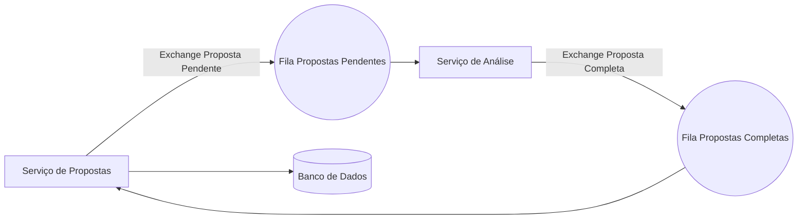

# Microsservios com RabbitMQ - Analisando seu crédito para empréstimo

## Motivações do projeto

- Esse projeto foi construido em um treinamento de Spring Boot + RabbitMQ.
- A ideia principal foi entender como funcionam arquitetura distribuidas e suas vantagens em relação as monoliticas.
- E implementar na prática um sistema para analisar créditos de clientes para um possivel empréstimo de forma totalmente assíncrona entre os serviços.

## Funcionalidades

- Solicitação de crédito pelo Serviço de Propostas  
- Processamento assíncrono via RabbitMQ  
- Análise automatizada com resultado aprovado/reprovado  
- Armazenamento do histórico das propostas  
- Visualização com justificativa da decisão  

---


## Fluxo do sistema



---

## Tecnologias Utilizadas

- Java 21  
- Spring Boot
- RabbitMQ  
- PostgreSQL  
- Docker  

---

## Minhas principais implementações e aprendizados nesse projeto
- Aprendi conceitos como filas, exchanges, consumers e como eles se comportam com o message broker RabbitMQ.
- Entendi a diferença de monolitico e arquitetura de microsserviços, e as motivações de quando escolher um ou outro.
- Implementei resiliência com um status na entidade e utilizando a anotação @Scheduler para garantir que os dados fossem processados.
- Configuração e comunicação entre os serviços em uma aplicação Spring Boot


## Caso queira testar o projeto

### Requisitos
- Docker
- Postman

```bash
# Clone o repositório
https://github.com/gustavokowallski/CreditCheckAPI.git
cd CreditCheckAPI

# Suba os containers
docker compose up -d --build
```

#### Testes via Postman


### 1️⃣ Via Postman Collection
[](https://nawszera.postman.co/workspace/nawszera's-Workspace~ea6779bc-203d-4c77-8395-e87a3f1091fa/request/45108000-ac49d0f5-af68-43ff-bdeb-6e6618b4cc11?action=share&creator=45108000&ctx=documentation&active-environment=45108000-ee357952-f911-405a-9337-066beac8e080)


---

### Os serviços foram desenvolvidos em repositórios diferentes e juntei nesse aqui.

- Caso queira, veja os serviços separados:

[Serviço de Propostas](https://github.com/gustavokowallski/Proposta-app-) | [Serviço de Análise de Crédito](https://github.com/gustavokowallski/Analise-credito-app)  


---

### Visão geral do projeto:

- Meu primeiro contato com Microsserviços e Mensageria.
- Projeto importante para entender a implementação e principalmente conceitos, permitindo atuar em equipes e aprender mais no dia a dia.
- Atualmente estou aprendendo sobre Kafka e os conhecimentos adquiridos aqui estão me ajudando muito.

<p>
  <a href="https://www.linkedin.com/in/gustavokowalski/" target="_blank" style="margin-right: 20px;">
    
  </a>


